# [📈 Live Status](https://demo.upptime.js.org): <!--live status--> **🟧 Partial outage**

This repository contains the open-source uptime monitor and status page for [Javier Suela](https://demo.upptime.js.org), powered by [Upptime](https://github.com/upptime/upptime).

With [Upptime](https://upptime.js.org), you can get your own unlimited and free uptime monitor and status page, powered entirely by a GitHub repository. We use [Issues](https://github.com/javisu/monitor/issues) as incident reports, [Actions](https://github.com/javisu/monitor/actions) as uptime monitors, and [Pages](https://demo.upptime.js.org) for the status page.

<!--start: status pages-->
<!-- This summary is generated by Upptime (https://github.com/upptime/upptime) -->
<!-- Do not edit this manually, your changes will be overwritten -->
<!-- prettier-ignore -->
| URL | Status | History | Response Time | Uptime |
| --- | ------ | ------- | ------------- | ------ |
|  [Alberto Alcocer,30](http://159.65.204.200:7001/) | 🟩 Up | [alberto-alcocer-30.yml](https://github.com/javisu/monitor/commits/HEAD/history/alberto-alcocer-30.yml) | 

 353ms
     
 | 

<a href="https://javisu.github.io/monitor/history/alberto-alcocer-30">99.80%</a>
    

|  [Aliaga, Troya y Etruria](http://159.65.204.200:7002/) | 🟥 Down | [aliaga-troya-y-etruria.yml](https://github.com/javisu/monitor/commits/HEAD/history/aliaga-troya-y-etruria.yml) | 

 0ms
     
 | 

<a href="https://javisu.github.io/monitor/history/aliaga-troya-y-etruria">0.00%</a>
    

|  [Apolonio Morales, 4](http://159.65.204.200:7003/) | 🟥 Down | [apolonio-morales-4.yml](https://github.com/javisu/monitor/commits/HEAD/history/apolonio-morales-4.yml) | 

 3297ms
     
 | 

<a href="https://javisu.github.io/monitor/history/apolonio-morales-4">0.00%</a>
    

|  [Capitán Haya 35 Calor](http://159.65.204.200:7004/) | 🟩 Up | [capitan-haya-35-calor.yml](https://github.com/javisu/monitor/commits/HEAD/history/capitan-haya-35-calor.yml) | 

 368ms
     
 | 

<a href="https://javisu.github.io/monitor/history/capitan-haya-35-calor">0.00%</a>
    

|  [Capitán Haya 35 Frio](http://159.65.204.200:7005/) | 🟩 Up | [capitan-haya-35-frio.yml](https://github.com/javisu/monitor/commits/HEAD/history/capitan-haya-35-frio.yml) | 

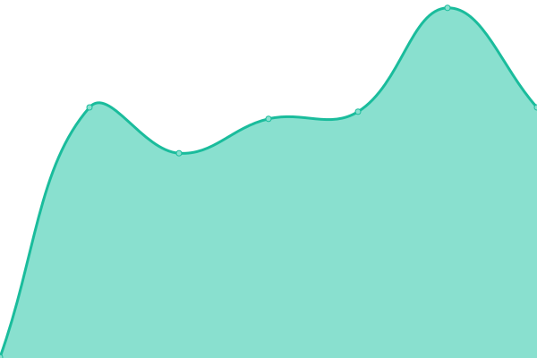 363ms
     
 | 

<a href="https://javisu.github.io/monitor/history/capitan-haya-35-frio">100.00%</a>
    

|  [Cardenal Siliceo 25](http://159.65.204.200:7006/) | 🟩 Up | [cardenal-siliceo-25.yml](https://github.com/javisu/monitor/commits/HEAD/history/cardenal-siliceo-25.yml) | 

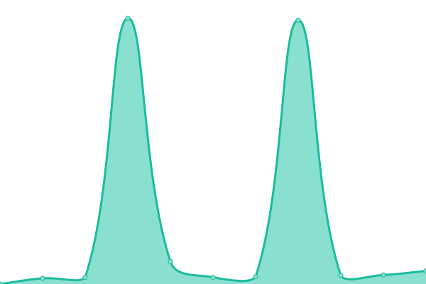 404ms
     
 | 

<a href="https://javisu.github.io/monitor/history/cardenal-siliceo-25">14.35%</a>
    

|  [Castello 110](http://159.65.204.200:7007/) | 🟩 Up | [castello-110.yml](https://github.com/javisu/monitor/commits/HEAD/history/castello-110.yml) | 

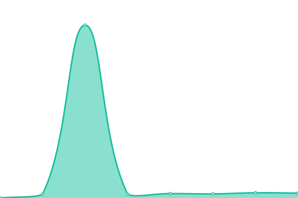 529ms
     
 | 

<a href="https://javisu.github.io/monitor/history/castello-110">100.00%</a>
    

|  [Diligencia, 4 (1)](http://159.65.204.200:7008/) | 🟩 Up | [diligencia-4-1.yml](https://github.com/javisu/monitor/commits/HEAD/history/diligencia-4-1.yml) | 

 417ms
     
 | 

<a href="https://javisu.github.io/monitor/history/diligencia-4-1">0.00%</a>
    

|  [Diligencia, 4 (2)](http://159.65.204.200:7009/) | 🟩 Up | [diligencia-4-2.yml](https://github.com/javisu/monitor/commits/HEAD/history/diligencia-4-2.yml) | 

 371ms
     
 | 

<a href="https://javisu.github.io/monitor/history/diligencia-4-2">100.00%</a>
    

|  [Doctor Barraquer 1-21 (La Herradura I)](http://159.65.204.200:7010/) | 🟥 Down | [doctor-barraquer-1-21-la-herradura-i.yml](https://github.com/javisu/monitor/commits/HEAD/history/doctor-barraquer-1-21-la-herradura-i.yml) | 

 0ms
     
 | 

<a href="https://javisu.github.io/monitor/history/doctor-barraquer-1-21-la-herradura-i">0.00%</a>
    

|  [Don Ramón de la Cruz, 66](http://159.65.204.200:7011/) | 🟩 Up | [don-ramon-de-la-cruz-66.yml](https://github.com/javisu/monitor/commits/HEAD/history/don-ramon-de-la-cruz-66.yml) | 

 653ms
     
 | 

<a href="https://javisu.github.io/monitor/history/don-ramon-de-la-cruz-66">99.69%</a>
    

|  [Donoso Cortés, 76](http://159.65.204.200:7012/) | 🟥 Down | [donoso-cortes-76.yml](https://github.com/javisu/monitor/commits/HEAD/history/donoso-cortes-76.yml) | 

 0ms
     
 | 

<a href="https://javisu.github.io/monitor/history/donoso-cortes-76">0.00%</a>
    

|  [Écija, 6](http://159.65.204.200:7013/) | 🟩 Up | [ecija-6.yml](https://github.com/javisu/monitor/commits/HEAD/history/ecija-6.yml) | 

 385ms
     
 | 

<a href="https://javisu.github.io/monitor/history/ecija-6">100.00%</a>
    

|  [Embajadores, 81](http://159.65.204.200:7014/) | 🟩 Up | [embajadores-81.yml](https://github.com/javisu/monitor/commits/HEAD/history/embajadores-81.yml) | 

 375ms
     
 | 

<a href="https://javisu.github.io/monitor/history/embajadores-81">98.64%</a>
    

|  [Española, 11](http://159.65.204.200:7015/) | 🟥 Down | [espanola-11.yml](https://github.com/javisu/monitor/commits/HEAD/history/espanola-11.yml) | 

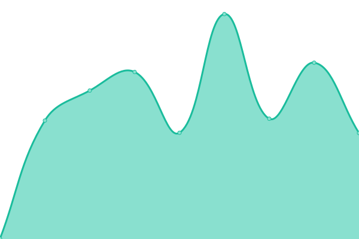 0ms
     
 | 

<a href="https://javisu.github.io/monitor/history/espanola-11">0.00%</a>
    

|  [Fuentebella, 65-67](http://159.65.204.200:7016/) | 🟩 Up | [fuentebella-65-67.yml](https://github.com/javisu/monitor/commits/HEAD/history/fuentebella-65-67.yml) | 

 388ms
     
 | 

<a href="https://javisu.github.io/monitor/history/fuentebella-65-67">99.66%</a>
    

|  [Fuentebella, 68-70](http://159.65.204.200:7017/) | 🟩 Up | [fuentebella-68-70.yml](https://github.com/javisu/monitor/commits/HEAD/history/fuentebella-68-70.yml) | 

 810ms
     
 | 

<a href="https://javisu.github.io/monitor/history/fuentebella-68-70">99.75%</a>
    

|  [Fundación Bobath](http://159.65.204.200:7018/) | 🟥 Down | [fundacion-bobath.yml](https://github.com/javisu/monitor/commits/HEAD/history/fundacion-bobath.yml) | 

 0ms
     
 | 

<a href="https://javisu.github.io/monitor/history/fundacion-bobath">0.00%</a>
    

|  [General Díaz Porlier, 45](http://159.65.204.200:7019/) | 🟥 Down | [general-diaz-porlier-45.yml](https://github.com/javisu/monitor/commits/HEAD/history/general-diaz-porlier-45.yml) | 

 0ms
     
 | 

<a href="https://javisu.github.io/monitor/history/general-diaz-porlier-45">0.00%</a>
    

|  [Gran Habitat, 4](http://159.65.204.200:7020/) | 🟩 Up | [gran-habitat-4.yml](https://github.com/javisu/monitor/commits/HEAD/history/gran-habitat-4.yml) | 

 4951ms
     
 | 

<a href="https://javisu.github.io/monitor/history/gran-habitat-4">72.20%</a>
    

|  [Hilarión Eslava, 37](http://159.65.204.200:7021/) | 🟥 Down | [hilarion-eslava-37.yml](https://github.com/javisu/monitor/commits/HEAD/history/hilarion-eslava-37.yml) | 

 366ms
     
 | 

<a href="https://javisu.github.io/monitor/history/hilarion-eslava-37">27.15%</a>
    

|  [Ofelia Nieto, 57](http://159.65.204.200:7022/) | 🟥 Down | [ofelia-nieto-57.yml](https://github.com/javisu/monitor/commits/HEAD/history/ofelia-nieto-57.yml) | 

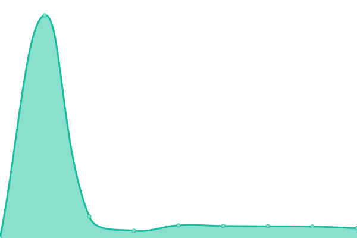 0ms
     
 | 

<a href="https://javisu.github.io/monitor/history/ofelia-nieto-57">0.00%</a>
    

|  [Ofelia Nieto, 59](http://159.65.204.200:7023/) | 🟩 Up | [ofelia-nieto-59.yml](https://github.com/javisu/monitor/commits/HEAD/history/ofelia-nieto-59.yml) | 

 674ms
     
 | 

<a href="https://javisu.github.io/monitor/history/ofelia-nieto-59">100.00%</a>
    

|  [Orense, 23](http://159.65.204.200:7024/) | 🟥 Down | [orense-23.yml](https://github.com/javisu/monitor/commits/HEAD/history/orense-23.yml) | 

 286ms
     
 | 

<a href="https://javisu.github.io/monitor/history/orense-23">0.00%</a>
    

|  [Principe de Vergara, 197](http://159.65.204.200:7025/) | 🟩 Up | [principe-de-vergara-197.yml](https://github.com/javisu/monitor/commits/HEAD/history/principe-de-vergara-197.yml) | 

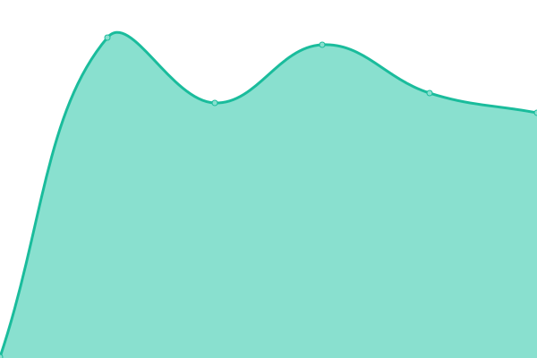 348ms
     
 | 

<a href="https://javisu.github.io/monitor/history/principe-de-vergara-197">68.54%</a>
    

|  [Ventura Rodriguez, 5](http://159.65.204.200:7026/) | 🟩 Up | [ventura-rodriguez-5.yml](https://github.com/javisu/monitor/commits/HEAD/history/ventura-rodriguez-5.yml) | 

 340ms
     
 | 

<a href="https://javisu.github.io/monitor/history/ventura-rodriguez-5">100.00%</a>
    

|  [Arroyo del Coronel](http://159.65.204.200:7027/) | 🟩 Up | [arroyo-del-coronel.yml](https://github.com/javisu/monitor/commits/HEAD/history/arroyo-del-coronel.yml) | 

 353ms
     
 | 

<a href="https://javisu.github.io/monitor/history/arroyo-del-coronel">100.00%</a>
    

|  [Avda. del Mediterráneo, 30](http://159.65.204.200:7028/) | 🟩 Up | [avda-del-mediterraneo-30.yml](https://github.com/javisu/monitor/commits/HEAD/history/avda-del-mediterraneo-30.yml) | 

 348ms
     
 | 

<a href="https://javisu.github.io/monitor/history/avda-del-mediterraneo-30">0.00%</a>
    

|  [Avda. del Mediterráneo, 12-14](http://159.65.204.200:7029/) | 🟥 Down | [avda-del-mediterraneo-12-14.yml](https://github.com/javisu/monitor/commits/HEAD/history/avda-del-mediterraneo-12-14.yml) | 

 0ms
     
 | 

<a href="https://javisu.github.io/monitor/history/avda-del-mediterraneo-12-14">0.00%</a>
    

|  [Avda. de Pio XII, 94](http://159.65.204.200:7030/) | 🟩 Up | [avda-de-pio-xii-94.yml](https://github.com/javisu/monitor/commits/HEAD/history/avda-de-pio-xii-94.yml) | 

 309ms
     
 | 

<a href="https://javisu.github.io/monitor/history/avda-de-pio-xii-94">16.09%</a>
    

|  [Claudio Coello, 23](http://159.65.204.200:7031/) | 🟩 Up | [claudio-coello-23.yml](https://github.com/javisu/monitor/commits/HEAD/history/claudio-coello-23.yml) | 

 348ms
     
 | 

<a href="https://javisu.github.io/monitor/history/claudio-coello-23">100.00%</a>
    

|  [Kerria, 28-40](http://159.65.204.200:7032/) | 🟩 Up | [kerria-28-40.yml](https://github.com/javisu/monitor/commits/HEAD/history/kerria-28-40.yml) | 

 354ms
     
 | 

<a href="https://javisu.github.io/monitor/history/kerria-28-40">0.00%</a>
    

|  [Orense, 22](http://159.65.204.200:7033/) | 🟩 Up | [orense-22.yml](https://github.com/javisu/monitor/commits/HEAD/history/orense-22.yml) | 

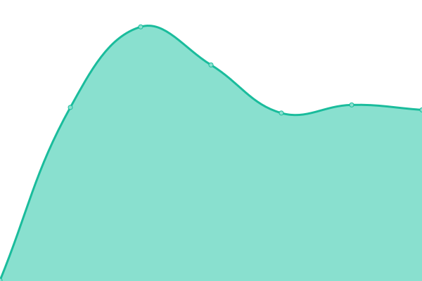 343ms
     
 | 

<a href="https://javisu.github.io/monitor/history/orense-22">100.00%</a>
    

|  [Pensamiento, 23](http://159.65.204.200:7034/) | 🟩 Up | [pensamiento-23.yml](https://github.com/javisu/monitor/commits/HEAD/history/pensamiento-23.yml) | 

 349ms
     
 | 

<a href="https://javisu.github.io/monitor/history/pensamiento-23">0.00%</a>
    

|  [Peñasanta, 14](http://159.65.204.200:7035/) | 🟩 Up | [penasanta-14.yml](https://github.com/javisu/monitor/commits/HEAD/history/penasanta-14.yml) | 

 408ms
     
 | 

<a href="https://javisu.github.io/monitor/history/penasanta-14">0.00%</a>
    

|  [Castellana, 138](http://159.65.204.200:7036/) | 🟩 Up | [castellana-138.yml](https://github.com/javisu/monitor/commits/HEAD/history/castellana-138.yml) | 

 456ms
     
 | 

<a href="https://javisu.github.io/monitor/history/castellana-138">100.00%</a>
    

|  [Etruria, 37](http://159.65.204.200:7037/) | 🟩 Up | [etruria-37.yml](https://github.com/javisu/monitor/commits/HEAD/history/etruria-37.yml) | 

 338ms
     
 | 

<a href="https://javisu.github.io/monitor/history/etruria-37">0.00%</a>
    

|  [Colegio Malvar Producción](http://159.65.204.200:7038/) | 🟩 Up | [colegio-malvar-produccion.yml](https://github.com/javisu/monitor/commits/HEAD/history/colegio-malvar-produccion.yml) | 

 2113ms
     
 | 

<a href="https://javisu.github.io/monitor/history/colegio-malvar-produccion">99.61%</a>
    

|  [Colegio Malvar Principal](http://159.65.204.200:7039/) | 🟩 Up | [colegio-malvar-principal.yml](https://github.com/javisu/monitor/commits/HEAD/history/colegio-malvar-principal.yml) | 

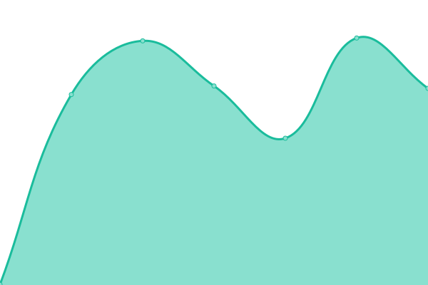 409ms
     
 | 

<a href="https://javisu.github.io/monitor/history/colegio-malvar-principal">100.00%</a>
    

|  [Colegio Malvar Infantiles](http://159.65.204.200:7040/) | 🟩 Up | [colegio-malvar-infantiles.yml](https://github.com/javisu/monitor/commits/HEAD/history/colegio-malvar-infantiles.yml) | 

 417ms
     
 | 

<a href="https://javisu.github.io/monitor/history/colegio-malvar-infantiles">100.00%</a>
    

|  [Colegio Malvar Piscina](http://159.65.204.200:7041/) | 🟩 Up | [colegio-malvar-piscina.yml](https://github.com/javisu/monitor/commits/HEAD/history/colegio-malvar-piscina.yml) | 

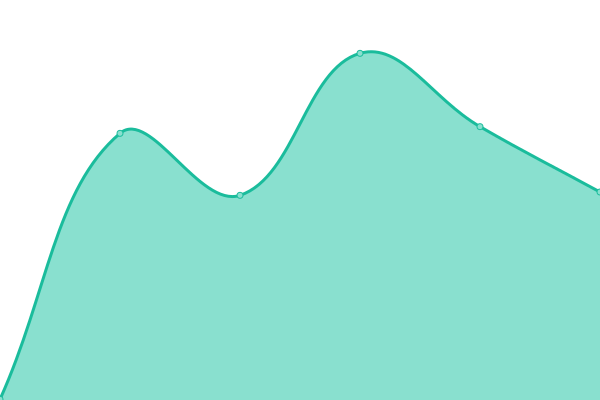 413ms
     
 | 

<a href="https://javisu.github.io/monitor/history/colegio-malvar-piscina">100.00%</a>
    

|  [Colodra, 5 SALA 1](http://159.65.204.200:7042/) | 🟩 Up | [colodra-5-sala-1.yml](https://github.com/javisu/monitor/commits/HEAD/history/colodra-5-sala-1.yml) | 

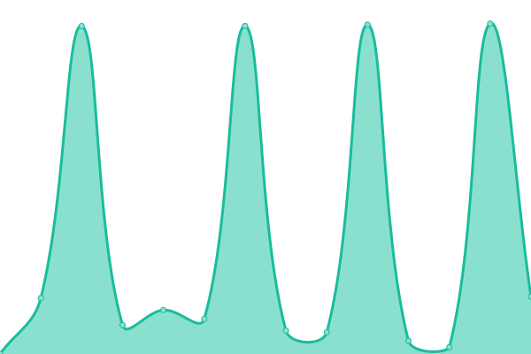 3557ms
     
 | 

<a href="https://javisu.github.io/monitor/history/colodra-5-sala-1">19.72%</a>
    

|  [Alfonso Rodriguez, 18](http://159.65.204.200:7043/) | 🟩 Up | [alfonso-rodriguez-18.yml](https://github.com/javisu/monitor/commits/HEAD/history/alfonso-rodriguez-18.yml) | 

 3122ms
     
 | 

<a href="https://javisu.github.io/monitor/history/alfonso-rodriguez-18">85.28%</a>
    

|  [Norma, 357](http://159.65.204.200:7044/) | 🟥 Down | [norma-357.yml](https://github.com/javisu/monitor/commits/HEAD/history/norma-357.yml) | 

 3298ms
     
 | 

<a href="https://javisu.github.io/monitor/history/norma-357">0.00%</a>
    

|  [Colodra, 5 SALA2](http://159.65.204.200:7045/) | 🟥 Down | [colodra-5-sala-2.yml](https://github.com/javisu/monitor/commits/HEAD/history/colodra-5-sala-2.yml) | 

 3300ms
     
 | 

<a href="https://javisu.github.io/monitor/history/colodra-5-sala-2">0.00%</a>
    

|  [Paseo de Extremadura, 298](http://159.65.204.200:7046/) | 🟩 Up | [paseo-de-extremadura-298.yml](https://github.com/javisu/monitor/commits/HEAD/history/paseo-de-extremadura-298.yml) | 

 7467ms
     
 | 

<a href="https://javisu.github.io/monitor/history/paseo-de-extremadura-298">73.55%</a>
    

|  [Antonio Acuña, 10](http://159.65.204.200:7047/) | 🟩 Up | [antonio-acuna-10.yml](https://github.com/javisu/monitor/commits/HEAD/history/antonio-acuna-10.yml) | 

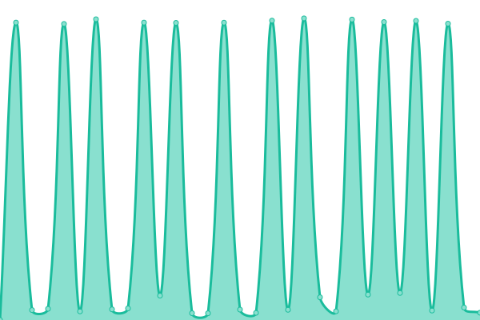 7369ms
     
 | 

<a href="https://javisu.github.io/monitor/history/antonio-acuna-10">90.13%</a>
    

|  [Cine, 50](http://159.65.204.200:7048/) | 🟩 Up | [cine-50.yml](https://github.com/javisu/monitor/commits/HEAD/history/cine-50.yml) | 

 884ms
     
 | 

<a href="https://javisu.github.io/monitor/history/cine-50">100.00%</a>
    

|  [Velazquez, 135](http://159.65.204.200:7049/) | 🟩 Up | [velazquez-135.yml](https://github.com/javisu/monitor/commits/HEAD/history/velazquez-135.yml) | 

 1141ms
     
 | 

<a href="https://javisu.github.io/monitor/history/velazquez-135">100.00%</a>
    

|  [Valderrebollo, 30](http://159.65.204.200:7050/) | 🟩 Up | [valderrebollo-30.yml](https://github.com/javisu/monitor/commits/HEAD/history/valderrebollo-30.yml) | 

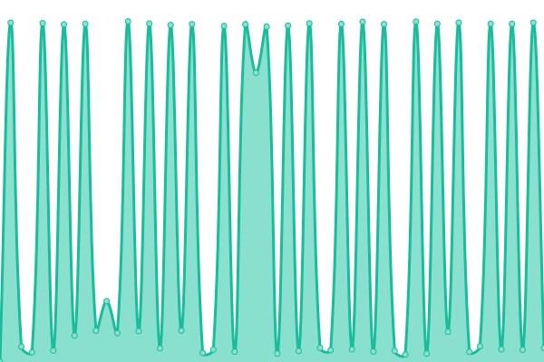 7685ms
     
 | 

<a href="https://javisu.github.io/monitor/history/valderrebollo-30">64.91%</a>
    

|  [Brescia, 4](http://159.65.204.200:7051/) | 🟩 Up | [brescia-4.yml](https://github.com/javisu/monitor/commits/HEAD/history/brescia-4.yml) | 

 3229ms
     
 | 

<a href="https://javisu.github.io/monitor/history/brescia-4">71.76%</a>
    

|  [Rodrigo de Triana, 1-8](http://159.65.204.200:7052/) | 🟥 Down | [rodrigo-de-triana-1-8.yml](https://github.com/javisu/monitor/commits/HEAD/history/rodrigo-de-triana-1-8.yml) | 

 566ms
     
 | 

<a href="https://javisu.github.io/monitor/history/rodrigo-de-triana-1-8">0.00%</a>
    

|  [Luis de Salazar, 16](http://159.65.204.200:7053/) | 🟩 Up | [luis-de-salazar-16.yml](https://github.com/javisu/monitor/commits/HEAD/history/luis-de-salazar-16.yml) | 

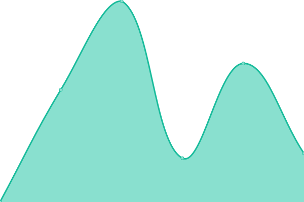 2212ms
     
 | 

<a href="https://javisu.github.io/monitor/history/luis-de-salazar-16">99.21%</a>
    

|  [Mediterraneo, 10](http://159.65.204.200:7054/) | 🟩 Up | [mediterraneo-10.yml](https://github.com/javisu/monitor/commits/HEAD/history/mediterraneo-10.yml) | 

 7381ms
     
 | 

<a href="https://javisu.github.io/monitor/history/mediterraneo-10">79.19%</a>
    

|  [Poeta Joan Maragall, 16](http://159.65.204.200:7055/) | 🟥 Down | [poeta-joan-maragall-16.yml](https://github.com/javisu/monitor/commits/HEAD/history/poeta-joan-maragall-16.yml) | 

 3239ms
     
 | 

<a href="https://javisu.github.io/monitor/history/poeta-joan-maragall-16">0.00%</a>
    

|  [Joaquin Bau, 5](http://159.65.204.200:7056/) | 🟥 Down | [joaquin-bau-5.yml](https://github.com/javisu/monitor/commits/HEAD/history/joaquin-bau-5.yml) | 

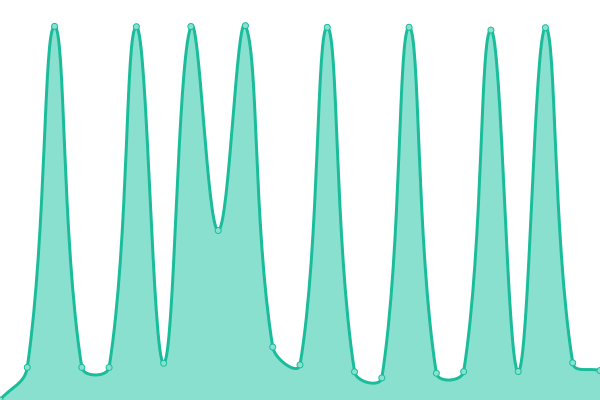 3291ms
     
 | 

<a href="https://javisu.github.io/monitor/history/joaquin-bau-5">100.00%</a>
    

|  [Rodriguez Marin, 88](http://159.65.204.200:7057/) | 🟩 Up | [rodriguez-marin-88.yml](https://github.com/javisu/monitor/commits/HEAD/history/rodriguez-marin-88.yml) | 

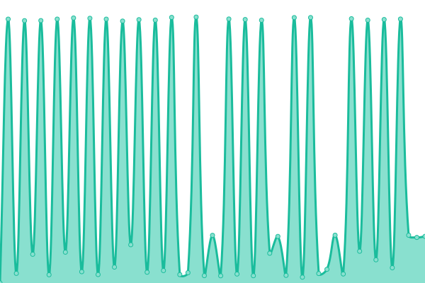 9159ms
     
 | 

<a href="https://javisu.github.io/monitor/history/rodriguez-marin-88">86.36%</a>
    

|  [Uruguay, 16](http://159.65.204.200:7058/) | 🟥 Down | [uruguay-16.yml](https://github.com/javisu/monitor/commits/HEAD/history/uruguay-16.yml) | 

 3417ms
     
 | 

<a href="https://javisu.github.io/monitor/history/uruguay-16">0.00%</a>
    

|  [Abeto, 2](http://159.65.204.200:7059/) | 🟥 Down | [abeto-2.yml](https://github.com/javisu/monitor/commits/HEAD/history/abeto-2.yml) | 

 3299ms
     
 | 

<a href="https://javisu.github.io/monitor/history/abeto-2">0.00%</a>
    

<!--end: status pages-->

[**Visit our status website →**](https://demo.upptime.js.org)

## 📄 License

- Powered by: [Upptime](https://github.com/upptime/upptime)
- Code: [MIT](./LICENSE) © [Javier Suela](https://demo.upptime.js.org)
- Data in the `./history` directory: [Open Database License](https://opendatacommons.org/licenses/odbl/1-0/)
